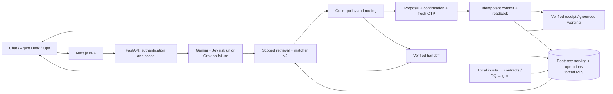

# Aclara

Aclara helps a signed-in customer understand an unfamiliar charge, confirm an
eligible dispute, or reach a human with verified context, in **Spanish and
Brazilian Portuguese**. Customer Chat, Agent Desk and Ops show supporting records,
policy rules and readbacks. This is a **synthetic-bank demo**, not a real bank.

P uses **Gemini 3 Flash** for language, **Jev** for risk-cue union, **Grok 4.20** on
Gemini failure, and matcher v2 for scoped ranking. B1 uses deterministic language
rules. **Identity, policy and writes stay in code; model prose grants no authority.**
[Architecture](docs/architecture.md) · [Model card](docs/ml/model-card.md).

## Three stories to try

Use the guided stories and supplied charge details. Demo access/credentials come
from the owner; the UI displays simulated SMS OTP. Cloud access is restricted.
[Access checklist](docs/submission/checklist.md).

| Story | What to inspect |
|---|---|
| **Explain — ES** | Ask about the supplied charge; open “¿Por qué?” for the record/rule. Bare non-recognition leads to an explanation and dispute offer; an ordinary status question ends with an explanation. |
| **Clarify and confirm — pt-BR** | Choose the intended ambiguous transaction. Review and confirm or cancel the exact proposal if eligible. A case receipt requires committed readback; policy may instead require a human. |
| **Lost/stolen card — ES/PT** | Inspect the handoff. If blocking is available, verify fresh OTP, separate confirmation, the freeze receipt and the facts/actions passed to Agent Desk. |

Staff views remain in the authenticated workspace; cloud reset is disabled.
[Serving boundary](docs/serving-demo.md).

## Architecture



## Evaluation and limits

Code grades objective outcomes; Sonnet and Jev judge subjective wording only.
V3 used a fresh suite after v2-informed fixes; it does not revise v2.

| Evaluation | B1 pass | P-Gemini pass | B1 / P in-scope SAR |
|---|---:|---:|---:|
| [V2 official](docs/evaluation/final-v2-error-analysis.md) | 65/200 | 63/200 | 21.2% / 20.2% |
| [V3 after fixes](docs/evaluation/final-v3-results.md) | **52/100** | **77/100** | **28% / 39%** |
| V4 independent evaluation, pending | TODO(results) | TODO(results) | TODO(results) |

V3's paired SAR difference is **+11 pp (95% CI +5 to +17)**; strict escalation was
20/40 versus 30/40. P cost **$0.00237687544/conversation**, with case system-time
p50/p95 **7.432/13.704 s**, including workstation-to-Azure Postgres reads.
[Assumption-labeled business projection](docs/evaluation/business-projection.md).

**V2 and v3 failed full safety gates.** V3 had zero observed critical unsafe events
but failed fraud/regulator recall and required-readback coverage; judging completed
28/60 pairs. V3 is now dev data; seen-case checks do not replace 77/100. V4 stays
blind. Synthetic data, nine human es-CL cases, no fluent-human PT review and unscored
human judge calibration limit generalization. Simulated OTP is not independent
MFA. Real banking/identity integration, load/recovery and privacy controls remain
[production work](docs/production-readiness.md).

## Run locally without model spend

Requires Python 3.12, `uv`, Docker Compose and authorized local organizer files
for the full serving demo. In a new checkout, copy `.env.example` to ignored
`.env`; fill Postgres/demo passwords and `LOCAL_RAW_DIR`. Keep
`LLM_PROVIDER=mock`, `LLM_REAL_CALLS_APPROVED=0`, and `LAKE_DIR=./lake` for the local
loader. Use a unique Compose project and host ports per worktree.

```sh
uv sync --extra dev --extra data-ml
uv run --no-sync python -m scripts.local_ops
docker compose up -d --wait postgres
docker compose run --rm migrate
uv run --no-sync python -m aclara.data.cli build --lake lake --no-reports
uv run --no-sync python -m scripts.load_demo_serving --target local
LLM_PROVIDER=mock make up
uv run --no-sync python -m scripts.local_smoke
LLM_PROVIDER=mock make checks
```

Open `http://localhost:<WEB_HOST_PORT>` (default 3000) with a bound demo persona
and your local password. Missing promoted data/clock/bindings fail closed.
**Mock checks need no organizer files**: install dev extras and run
`LLM_PROVIDER=mock make checks`. [Setup](docs/serving-demo.md) ·
[Harness](docs/evaluation/harness.md) · [Progress](docs/status/progress-log.md).

Never enter real personal data. Organizer rows, credentials, private traces and
model thinking stay out of Git/CI. This quickstart runs no frozen evaluation.
