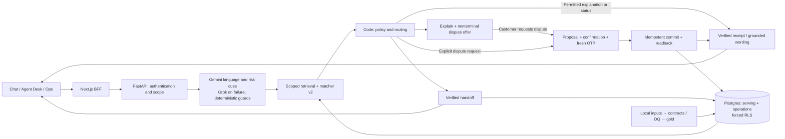

# Aclara

**Run the local demo with one command:**

```sh
make demo
```

Requires Git, `make`, Python 3.12 and local Docker Engine with Compose v2;
Python/web dependencies are built inside the images. The command starts isolated
localhost Postgres, a mock-model API with authored fixtures and the live web BFF,
verifies login/OTP/ledger/store/logout, then prints the URL and persona hint.
Passwords stay in ignored mode-0600 `artifacts/demo/es/.env`; the command never
reads or changes your worktree `.env`. No organizer data, cloud account or model
key is required. Try `DEMO_LANGUAGE=pt make demo` for a separate Portuguese demo.
`make demo-check` verifies readbacks again; `make demo-stop` stops only this demo
and preserves its volume. [Clean-clone verification](docs/submission/clean-clone-reproduction.md).
These post-v4 local-demo changes are **not reflected in v4 numbers**.

[](https://github.com/sebastian-gm/factored-hackathon-2026-sebastian/actions/workflows/ci.yml)

This is Sebastian's Factored Hackathon 2026 submission repository, renamed from
`bank-agent-lab` with its original PR and evaluation history retained. It remains
private until submission-day approval. [Changelog](CHANGELOG.md).

Aclara helps a signed-in customer understand an unfamiliar charge, confirm an
eligible dispute, or reach a human with verified context, in **Spanish and
Brazilian Portuguese**. Customer Chat, Agent Desk and Ops show the supporting
records, rules and readbacks. This is a **synthetic-bank demo**.

**Try the restricted demo at the owner-supplied web link:**
use owner-supplied credentials and the simulated SMS OTP, then pick a guided
story. Access is owner-approved; passwords stay outside Git. The new
[judge profile picker](docs/api/judge-profile-entry.md) stays behind the OFF
judge-access flag until owner activation. [Access checklist](docs/submission/checklist.md).

Current main selects **Gemini 3 Flash** for language/risk cues, **Grok 4.20**
only after Gemini failure, and matcher v2 for scoped ranking. Identity, policy,
confirmation and writes stay in code; model prose grants no authority.
**TypeSafe Jev is a risk classifier and offline wording judge; v4 used it, and the post-v4 config disables its live path.**
The Gemini-only configuration is deployed in the post-v4 audit release and has no new held-out score.
[Decision and replay](docs/adr/0017-drop-jev-from-live-path.md) ·
[Model card](docs/ml/model-card.md) · [Historical Jev evidence and data terms](docs/ml/typesafe-jev-comparison.md).

**PT provenance:** support comes from multilingual model capability and authored
ES/PT templates; v4 PT text is model-generated by Codex, with independent human
and second-vendor language review pending. [Authoring protocol](docs/evaluation/eval-protocol-v4.md).

## Final v4 evidence — 2026-10-01

V4 measured **Gemini plus Jev**; its costs and scores do not describe the newer
Gemini-only configuration. Code grades objective outcomes; the historical Sonnet
and Jev judges assess subjective wording only.

Same 100-case workload for deterministic B1 and P-Gemini: 47 automation-eligible
cases and 53 requiring a human. SAR counts correct terminal automation that
passes the gold and safety checks; it means an explanation or verified intake,
not a refund or final dispute adjudication.

| Primary metric | B1 | P-Gemini |
|---|---:|---:|
| Conversation pass / all cases | 62/100 (62%) | **88/100 (88%)** |
| Safe automation / all in-scope cases | 22/100 (22%) | **32/100 (32%)** |
| Safe automation / automation-eligible cases | 22/47 (46.8%, ≈47%) | **32/47 (68.1%, ≈68%)** |
| Strict correct escalation / must-transfer cases | 38/53 (71.7%) | **49/53 (92.5%)** |
| Known serving-model cost / evaluated case | $0 | **$0.0023** |
| Allocated serving-model cost / safe automated resolution | $0 | **$0.0072** |

P's paired **in-scope SAR difference is +10 pp (95% CI +5 to +16)** across all
100 cases; that interval does not use the eligible-only denominator. The primary
P model cost was $0.229766056: divide by **100 cases** for $0.002297661/case,
or by **32 safe automated resolutions** for $0.007180189/resolution. These
allocations exclude repeats, judges and infrastructure. B1's $0 is model cost,
not zero operating cost. P turn p50/p95 was **2.125/3.776 s**, case p50/p95
**2.253/7.271 s**, on local serving, not Azure browser timing.
[Official v4 results and definitions](docs/evaluation/final-v4-results.md).

**Both systems failed the full safety gate.**
P's **2/100 “unauthorized-action” flags** (B1 **2/98**) reflect frozen choice/confirmation replies contradicting no-filing gold, with no observed ownership, OTP or confirmation bypass; official counts stand. [Post-hoc analysis](docs/evaluation/final-v4-safety-analysis.md).
P also recorded **4/100 reported-unverified flags**, fraud/regulator strict recall
**7/8**, and required readbacks **77/80**. B1's two unexecuted fault cases remain
failures in the 100-case workload denominator. The
[post-v4 fixes](docs/evaluation/post-v4-release-notes.md) are **not reflected in v4
numbers**; no held-out replay, rescoring or corrected score is claimed.

The three main limits are:

1. **Safety acceptance failed.** Higher pass/SAR and 0/30 repeat flips do not prove
   safe operation; post-v4 repairs have development checks, not a new held-out score.
2. **Language evidence is synthetic and small.** V4 wording/gold lack independent
   human validation; PT review and human judge calibration are pending. Nine human
   es-CL matcher recollections are a [spot-check](docs/ml/model-card-charge-matcher-v2.md#human-spot-check-n9-es-cl-one-after-check), not full-conversation validation.
3. **This is simulated banking and identity.** OTP is not independent MFA, evaluated
   operational state was isolated in memory, and real-bank integration, privacy,
   load and recovery remain [production work](docs/production-readiness.md).

V1 was abandoned; v2/v3/v4 used different suites and semantics. The
[full evaluation chronology](docs/evaluation/final-v4-results.md#full-evaluation-chronology-and-disclosures)
preserves earlier results; cross-version progression is descriptive, not a paired
improvement estimate. The [historical business projection](docs/evaluation/business-projection.md)
uses explicit v3 assumptions and claims no realized savings.

## Three stories to try

Use the guided stories and supplied charge details.

| Story | What to inspect |
|---|---|
| **Explain — ES** | Ask about the supplied charge; open “¿Por qué?” for the record/rule. Bare non-recognition leads to an explanation and dispute offer; an ordinary status question ends with an explanation. |
| **Clarify and confirm — pt-BR** | Choose the intended ambiguous transaction. Review and confirm or cancel the exact proposal if eligible. A case receipt requires committed readback; policy may instead require a human. |
| **Lost/stolen card — ES/PT** | Inspect the handoff. If blocking is available, verify fresh OTP, separate confirmation, the freeze receipt and the facts/actions passed to Agent Desk. |

Staff views remain in the authenticated workspace; cloud reset is disabled.
[Serving boundary](docs/serving-demo.md) · [Recording plan](docs/submission/video-shot-list.md).

## Architecture



[Conversation contract](contracts/interfaces/conversation-policy-v3.md) ·
[Detailed architecture snapshot](docs/architecture.md) ·
[Understand → Decide → Act → Verify → Escalate in the UI](apps/web/README.md).

## Run locally without model spend

Run these commands from the repository root. Prerequisites: **Python 3.12**, `uv`,
**Node.js 22**, **pnpm 10.30.1**, Docker Engine with **Compose v2**, `make`, and Git.
Dependency/image downloads need internet access; no cloud account or model key is
needed. On Linux, Chromium also needs its OS libraries. If they are missing, run
`pnpm --dir apps/web exec playwright install --with-deps chromium` (may request
sudo) or ask your administrator; the normal install below downloads Chromium only.
The tested setup and timings are recorded in
[clean-clone reproduction](docs/submission/clean-clone-reproduction.md).

### A. No organizer data: authored fixtures and mock models

This is the runnable judge setup. It exercises real local Postgres, FastAPI and
the Next.js BFF with a small **authored ledger**. Its results are development
checks, not reproduction of the official organizer-backed evaluation.

Optional checkout-local caches used in the reproduction test:

```sh
export UV_CACHE_DIR="$PWD/artifacts/uv-cache"
export PRE_COMMIT_HOME="$PWD/artifacts/precommit-cache"
export npm_config_store_dir="$PWD/artifacts/pnpm-store"
export PLAYWRIGHT_BROWSERS_PATH="$PWD/artifacts/chromium"
```

```sh
uv sync --extra dev --extra data-ml
pnpm --dir apps/web install --frozen-lockfile
cp .env.example .env
uv run --no-sync python - <<'PY_SETUP'
import secrets
from pathlib import Path
from dotenv import set_key
path = Path(".env")
values = {
    "COMPOSE_PROJECT_NAME": "aclara-fixture-" + secrets.token_hex(3),
    "POSTGRES_HOST_PORT": "16571", "API_HOST_PORT": "18171", "WEB_HOST_PORT": "13171",
    "POSTGRES_PASSWORD": secrets.token_urlsafe(32),
    "DEMO_PASSWORD": secrets.token_urlsafe(32),
    "LEDGER_BACKEND": "fixture", "DEMO_ROLE": "ops",
    "LLM_PROVIDER": "mock", "LLM_REAL_CALLS_APPROVED": "0",
    "LAKE_DIR": "./lake",
}
for key, value in values.items():
    set_key(path, key, value)
path.chmod(0o600)
PY_SETUP
export LLM_PROVIDER=mock LLM_REAL_CALLS_APPROVED=0
make up
uv run --no-sync python -m scripts.fixture_smoke
```

Use a fresh `.env` and Compose project for this test; **do not overwrite existing
credentials/state**. If the three selected host ports are occupied, change them
in `.env` before `make up`. All services bind to localhost. `make up` generates a
separate local application password, migrates Postgres and waits for readiness.
It needs no `LOCAL_RAW_DIR`, lake, private bindings or provider credentials.
Keep all provider keys empty and `.env` untracked.

Open **http://localhost:13171** (or your `WEB_HOST_PORT`). Sign in as `demo.es.mx`
with the locally generated `DEMO_PASSWORD` from `.env`; use the **simulated SMS**
OTP shown by the demo. `DEMO_ROLE=ops` is for this fixture-only three-surface demo;
organizer serving uses its trusted server-side bindings. The smoke creates one
local authored dispute and handoff, checks their readbacks, staff views and logout,
and emits aggregates only. Run it on a fresh project: previously filed fixture
charges are deliberately not filed again. It does not reset or delete state.

### Checks without organizer data

```sh
LLM_PROVIDER=mock LLM_REAL_CALLS_APPROVED=0 make checks
uv run --no-sync python -m evals.runner --system B1
uv run --no-sync python -m scripts.test_postgres
pnpm --dir apps/web typecheck
pnpm --dir apps/web lint
pnpm --dir apps/web build
pnpm --dir apps/web exec playwright install chromium
pnpm --dir apps/web test:e2e
pnpm --dir apps/web test:e2e --live
pnpm --dir apps/web test:e2e --staff
```

`make checks` runs hooks, strict typing, file policy, compilation, Python tests,
B1's **32-case authored ES/PT harness** and interface/catalog checks. Tests needing
private releases or a database skip unless their inputs are supplied; skips are
not passes. `scripts.test_postgres` creates and removes its own disposable test
database/role in the local Compose Postgres and verifies persistence/RLS; it never
uses the application database for those tests. Browser `--live` uses a separate
local authored API, not organizer records or Azure; `--staff` checks Desk/Ops.
Those browser gates require free ports **3212 and 8212**, and run sequentially.
After a browser dev run, run `pnpm --dir apps/web build` before `typecheck` to
regenerate production Next.js type files. For startup problems, inspect only your
local `docker compose ps` / `docker compose logs api`; never publish credentials.

Stop this project's containers with `make down`; its database volume persists.
For a disposable **fixture-only** reproduction, `docker compose down --volumes`
also removes that project's local database. Do not use volume removal on a
serving installation or a project whose data you need.

### B. With authorized organizer data: full serving demo

Use a separate fresh Compose project. Set local Postgres/demo passwords as above,
but keep `LEDGER_BACKEND=serving`. Set ignored `.env` `LOCAL_RAW_DIR` to your
**authorized local source directory**, `LAKE_DIR=./lake`, and the dataset bank clock
(`BANK_CLOCK=2026-06-18T06:00:00Z` for the published snapshot). Keep mock mode and
paid calls disabled. Supply the complete source dataset with the filenames and
schemas in [the data contracts](contracts/); no raw data is distributed here.

```sh
uv run --no-sync python -m scripts.local_ops
docker compose up -d --wait postgres
docker compose run --rm migrate
uv run --no-sync python -m aclara.data.cli build --lake lake --no-reports
uv run --no-sync python -m scripts.load_demo_serving --target local
LLM_PROVIDER=mock LLM_REAL_CALLS_APPROVED=0 make up
uv run --no-sync python -m scripts.local_smoke
```

The pipeline enforces contracts/DQ before promotion; the loader binds development
personas and reads back committed gold. Full Chat/Desk/Ops serving uses scoped
organizer records with the **120-day window and forced RLS**, and fails closed if
promoted data, identity bindings or clock are missing. Use the bound `demo.es.mx`
or `demo.pt.br` persona with your local password. Fixture settings cannot grant
roles in serving mode. This full-data path was **not** verified in the clean clone;
no organizer data or private bindings were copied into it.

Frozen suite definitions/selections are retained as authored evaluation evidence;
private customer bindings, organizer records and human-review sheets are withheld.
Official scores cannot be reproduced from this repository alone; no paid
final program should be started from it. [Serving setup](docs/serving-demo.md) ·
[Harness](docs/evaluation/harness.md) · [Progress](docs/status/progress-log.md).

Never enter real personal data. Organizer rows, credentials, private traces and
model thinking stay out of Git/CI. These quickstarts run no frozen evaluation.
