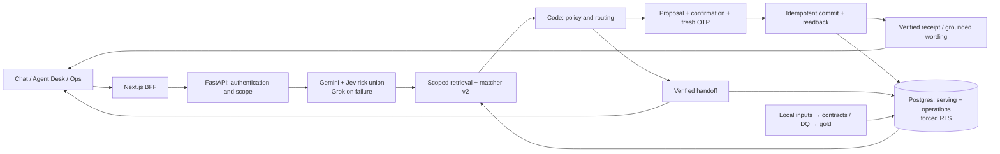

# Aclara

[](https://github.com/sebastian-gm/factored-hackathon-2026-sebastian/actions/workflows/ci.yml)

This is Sebastian's Factored Hackathon 2026 submission repository, renamed from
`bank-agent-lab` with its original PR and evaluation history retained. It remains
private until submission-day approval. [Changelog](CHANGELOG.md).

Aclara helps a signed-in customer understand an unfamiliar charge, confirm an
eligible dispute, or reach a human with verified context, in **Spanish and
Brazilian Portuguese**. Customer Chat, Agent Desk and Ops show supporting records,
policy rules and readbacks. This is a **synthetic-bank demo**, not a real bank.

P uses **Gemini 3 Flash** for language, **Jev** for risk-cue union, **Grok 4.20** on
Gemini failure, and matcher v2 for scoped ranking. B1 uses deterministic language
rules. **Identity, policy and writes stay in code; model prose grants no authority.**
[Architecture](docs/architecture.md) · [Model card](docs/ml/model-card.md).

## Three stories to try

Use the guided stories and supplied charge details. Demo access/credentials come
from the owner; the UI displays simulated SMS OTP. Cloud access is restricted.
[Access checklist](docs/submission/checklist.md).

| Story | What to inspect |
|---|---|
| **Explain — ES** | Ask about the supplied charge; open “¿Por qué?” for the record/rule. Bare non-recognition leads to an explanation and dispute offer; an ordinary status question ends with an explanation. |
| **Clarify and confirm — pt-BR** | Choose the intended ambiguous transaction. Review and confirm or cancel the exact proposal if eligible. A case receipt requires committed readback; policy may instead require a human. |
| **Lost/stolen card — ES/PT** | Inspect the handoff. If blocking is available, verify fresh OTP, separate confirmation, the freeze receipt and the facts/actions passed to Agent Desk. |

Staff views remain in the authenticated workspace; cloud reset is disabled.
[Serving boundary](docs/serving-demo.md).

## Architecture



## Evaluation and limits

Code grades objective outcomes; Sonnet and Jev judge subjective wording only.
V3 used a fresh suite after v2-informed fixes; it does not revise v2.

| Evaluation | B1 pass | P-Gemini pass | B1 / P in-scope SAR |
|---|---:|---:|---:|
| [V2 official](docs/evaluation/final-v2-error-analysis.md) | 65/200 | 63/200 | 21.2% / 20.2% |
| [V3 after fixes](docs/evaluation/final-v3-results.md) | **52/100** | **77/100** | **28% / 39%** |
| [V4 official](docs/evaluation/final-v4-results.md) | **62/100** | **88/100** | **22% / 32%** |

V4's paired SAR difference is **+10 pp (95% CI +5 to +16)**; strict escalation was
38/53 versus 49/53. P cost **$0.002297661/evaluated case**, with local-serving case
p50/p95 **2.253/7.271 s**. Outcome/pass/SAR flips were **0/30** repeated cases;
McNemar p=0.004 tests majority pass on that repeated subset.
[Assumption-labeled business projection](docs/evaluation/business-projection.md).

**V2, v3 and v4 failed full safety gates.** V4 P has two unauthorized-action
flags, four reported-unverified flags, fraud/regulator recall 7/8 and required
readbacks 77/80; judging completed 60/60 pairs. See the
[post-hoc safety analysis](docs/evaluation/final-v4-safety-analysis.md).
The [post-v4 fixes](docs/evaluation/post-v4-release-notes.md) are **not reflected
in official v4 numbers**. No held-out rerun or corrected score is claimed. Synthetic data, nine human es-CL cases, no fluent-human PT review and unscored
human judge calibration limit generalization. Simulated OTP is not independent
MFA. Real banking/identity integration, load/recovery and privacy controls remain
[production work](docs/production-readiness.md).

## Run locally without model spend

Run these commands from the repository root. Prerequisites: **Python 3.12**, `uv`,
**Node.js 22**, **pnpm 10.30.1**, Docker Engine with **Compose v2**, `make`, and Git.
Dependency/image downloads need internet access; no cloud account or model key is
needed. On Linux, Chromium also needs its OS libraries. If they are missing, run
`pnpm --dir apps/web exec playwright install --with-deps chromium` (may request
sudo) or ask your administrator; the normal install below downloads Chromium only.
The tested setup and timings are recorded in
[clean-clone reproduction](docs/submission/clean-clone-reproduction.md).

### A. No organizer data: authored fixtures and mock models

This is the runnable judge setup. It exercises real local Postgres, FastAPI and
the Next.js BFF with a small **authored ledger**. Its results are development
checks, not reproduction of the official organizer-backed evaluation.

Optional checkout-local caches used in the reproduction test:

```sh
export UV_CACHE_DIR="$PWD/artifacts/uv-cache"
export PRE_COMMIT_HOME="$PWD/artifacts/precommit-cache"
export npm_config_store_dir="$PWD/artifacts/pnpm-store"
export PLAYWRIGHT_BROWSERS_PATH="$PWD/artifacts/chromium"
```

```sh
uv sync --extra dev --extra data-ml
pnpm --dir apps/web install --frozen-lockfile
cp .env.example .env
uv run --no-sync python - <<'PY_SETUP'
import secrets
from pathlib import Path
from dotenv import set_key
path = Path(".env")
values = {
    "COMPOSE_PROJECT_NAME": "aclara-fixture-" + secrets.token_hex(3),
    "POSTGRES_HOST_PORT": "16571", "API_HOST_PORT": "18171", "WEB_HOST_PORT": "13171",
    "POSTGRES_PASSWORD": secrets.token_urlsafe(32),
    "DEMO_PASSWORD": secrets.token_urlsafe(32),
    "LEDGER_BACKEND": "fixture", "DEMO_ROLE": "ops",
    "LLM_PROVIDER": "mock", "LLM_REAL_CALLS_APPROVED": "0",
    "LAKE_DIR": "./lake",
}
for key, value in values.items():
    set_key(path, key, value)
path.chmod(0o600)
PY_SETUP
export LLM_PROVIDER=mock LLM_REAL_CALLS_APPROVED=0
make up
uv run --no-sync python -m scripts.fixture_smoke
```

Use a fresh `.env` and Compose project for this test; **do not overwrite existing
credentials/state**. If the three selected host ports are occupied, change them
in `.env` before `make up`. All services bind to localhost. `make up` generates a
separate local application password, migrates Postgres and waits for readiness.
It needs no `LOCAL_RAW_DIR`, lake, private bindings or provider credentials.
Keep all provider keys empty and `.env` untracked.

Open **http://localhost:13171** (or your `WEB_HOST_PORT`). Sign in as `demo.es.mx`
with the locally generated `DEMO_PASSWORD` from `.env`; use the **simulated SMS**
OTP shown by the demo. `DEMO_ROLE=ops` is for this fixture-only three-surface demo;
organizer serving uses its trusted server-side bindings. The smoke creates one
local authored dispute and handoff, checks their readbacks, staff views and logout,
and emits aggregates only. Run it on a fresh project: previously filed fixture
charges are deliberately not filed again. It does not reset or delete state.

### Checks without organizer data

```sh
LLM_PROVIDER=mock LLM_REAL_CALLS_APPROVED=0 make checks
uv run --no-sync python -m evals.runner --system B1
uv run --no-sync python -m scripts.test_postgres
pnpm --dir apps/web typecheck
pnpm --dir apps/web lint
pnpm --dir apps/web build
pnpm --dir apps/web exec playwright install chromium
pnpm --dir apps/web test:e2e
pnpm --dir apps/web test:e2e --live
pnpm --dir apps/web test:e2e --staff
```

`make checks` runs hooks, strict typing, file policy, compilation, Python tests,
B1's **32-case authored ES/PT harness** and interface/catalog checks. Tests needing
private releases or a database skip unless their inputs are supplied; skips are
not passes. `scripts.test_postgres` creates and removes its own disposable test
database/role in the local Compose Postgres and verifies persistence/RLS; it never
uses the application database for those tests. Browser `--live` uses a separate
local authored API, not organizer records or Azure; `--staff` checks Desk/Ops.
Those browser gates require free ports **3212 and 8212**, and run sequentially.
After a browser dev run, run `pnpm --dir apps/web build` before `typecheck` to
regenerate production Next.js type files. For startup problems, inspect only your
local `docker compose ps` / `docker compose logs api`; never publish credentials.

Stop this project's containers with `make down`; its database volume persists.
For a disposable **fixture-only** reproduction, `docker compose down --volumes`
also removes that project's local database. Do not use volume removal on a
serving installation or a project whose data you need.

### B. With authorized organizer data: full serving demo

Use a separate fresh Compose project. Set local Postgres/demo passwords as above,
but keep `LEDGER_BACKEND=serving`. Set ignored `.env` `LOCAL_RAW_DIR` to your
**authorized local source directory**, `LAKE_DIR=./lake`, and the dataset bank clock
(`BANK_CLOCK=2026-06-18T06:00:00Z` for the published snapshot). Keep mock mode and
paid calls disabled. Supply the complete source dataset with the filenames and
schemas in [the data contracts](contracts/); no raw data is distributed here.

```sh
uv run --no-sync python -m scripts.local_ops
docker compose up -d --wait postgres
docker compose run --rm migrate
uv run --no-sync python -m aclara.data.cli build --lake lake --no-reports
uv run --no-sync python -m scripts.load_demo_serving --target local
LLM_PROVIDER=mock LLM_REAL_CALLS_APPROVED=0 make up
uv run --no-sync python -m scripts.local_smoke
```

The pipeline enforces contracts/DQ before promotion; the loader binds development
personas and reads back committed gold. Full Chat/Desk/Ops serving uses scoped
organizer records with the **120-day window and forced RLS**, and fails closed if
promoted data, identity bindings or clock are missing. Use the bound `demo.es.mx`
or `demo.pt.br` persona with your local password. Fixture settings cannot grant
roles in serving mode. This full-data path was **not** verified in the clean clone;
no organizer data or private bindings were copied into it.

Frozen evaluation suites/selections, private bindings and human-review sheets are
withheld. Official scores cannot be reproduced from this export alone; no paid
final program should be started from it. [Serving setup](docs/serving-demo.md) ·
[Harness](docs/evaluation/harness.md) · [Progress](docs/status/progress-log.md).

Never enter real personal data. Organizer rows, credentials, private traces and
model thinking stay out of Git/CI. These quickstarts run no frozen evaluation.
