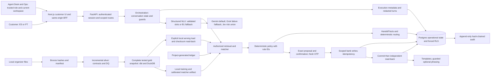
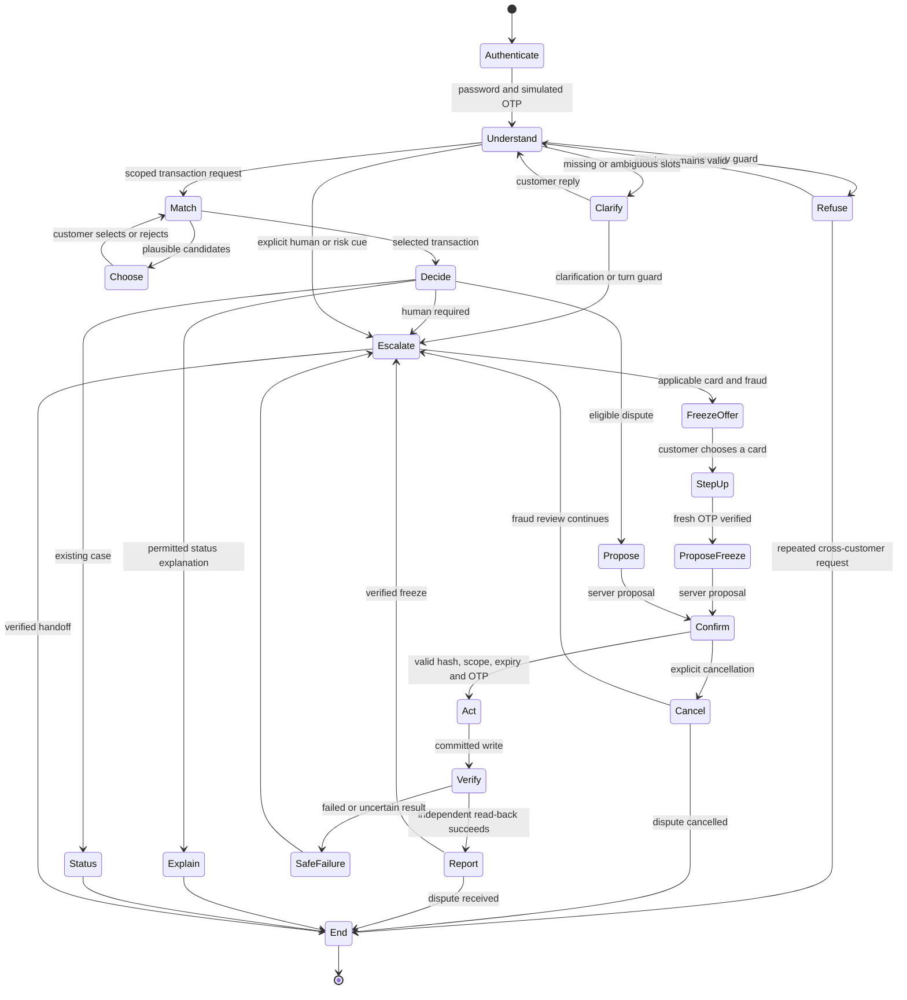

# Architecture as built

Scope: shipped backend contracts and the merged customer/staff UI in
[PR #17](https://github.com/sebastian-gm/bank-agent-lab/pull/17). Private real-model deployment is verified in the [progress log](status/progress-log.md). Solid paths below exist in code; dashed paths are pending integrations.

The runtime binds a checksummed organizer serving snapshot and trusted personas;
missing serving bindings fail closed. Project-generated fixtures remain the isolated
test path. Operational writes and model budget reservations use Postgres. No organizer
row values belong in diagrams or UI bundles. [Serving isolation](serving-demo.md).
The [data lineage image](data/dbt-lineage.svg) comes from the aggregate dbt manifest.

## Conversation and action state

The chart describes branches implemented in API/orchestration code, not a separate
workflow service. A message cannot supply an identity or authorize its own write.

Session expiry invalidates authority; the UI requires authentication and a new
proposal. Backend guards recheck policy and ownership at confirmation. Reads have
bounded failure handling; writes are not blindly retried. A model outage degrades
to B1/templates. The frontend additionally reads case, handoff and frozen-card
records before showing receipts. A revoked session can show the refusal but cannot
claim a new handoff read-back using its invalid token.

## AI and deterministic responsibilities

| Concern | Implemented mechanism | Reason and boundary |
| --- | --- | --- |
| Intent, language, recollection slots | P uses schema-validated structured NLU; B1 uses rules. Default mock can fall back. | Language is uncertain; extracted text never grants authority. Development model comparisons exist; final acceptance is pending. |
| Amount, relative date and currency interpretation | Deterministic normalization after extraction, using the bank clock; ambiguous currency asks a question. | Arithmetic and date semantics need repeatable tests. |
| Candidate retrieval | Authenticated customer scope, business-time window and serving contracts. | A model cannot widen access. |
| Transaction ranking | Validation-selected LightGBM v2; v1 and rules retained for comparison. | Learned ranking addresses noisy slots; confidence controls proposal/choice/no-match, not eligibility. |
| Fraud cues | Gemini flags unioned with thresholded Jev risk probabilities; deterministic score/case-burst guards. | No fraud model is trained from the generator's label leakage. Language cues have documented gaps. |
| Eligibility, escalation and routing | Versioned policy engine; active skill/language/load routing and recorded fallbacks. | Auditable rules, independent of model prose and protected characteristics. |
| Dispute and freeze | Server-issued action hash, scoped authorization, fresh OTP, explicit confirmation, idempotency and read-back. | Code owns side effects. |
| Critical action/status wording | Deterministic ES/PT templates. | Action claims require evidence; no promise of refund or credit. |
| Clarification and explanation phrasing | Optional model draft, fact/citation/DLP checks and template fallback. | Narrow language flexibility; checks are not complete semantic verification. |
| Handoff | Deterministic facts/actions/questions and routing. | The brief's optional model-written summary is not established as a live feature. |
| Audit and UI explanation | Execution events, rule IDs, sources and verification. | Model thinking is neither an audit artifact nor a UI feature. |

[API contract](../contracts/interfaces/openapi.json), [policy catalog](policy-catalog.md),
[durable-state ADR](adr/0013-durable-operations.md), [routing](handoff-routing.md),
[matcher card](ml/model-card-charge-matcher.md), and [AI interface proposal](ai-interface-proposal.md)
provide the detailed boundaries. Staff claim/resolve uses version and idempotency
checks plus a GET read-back. Ops reports measured current-workspace counts; SAR and
unsafe rates remain null without gold labels. Reset is disabled by default and
requires trusted flags, ops role, fresh OTP, exact confirmation and a read-back;
authentication and audit are retained. This is not a multi-customer staff queue.

OpenTelemetry export, comprehensive retention and operational SLOs remain production
work. Private real-model deployment and browser flows are verified in the
[release progress log](status/progress-log.md). The final held-out evaluation remains
separate from smoke evidence. The earlier mock diagnostic failed acceptance gates.
