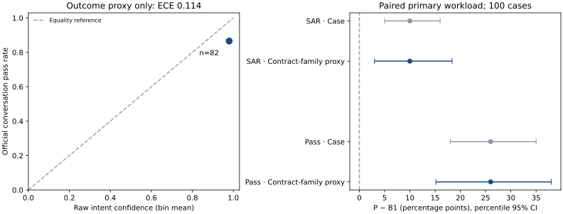

# V4 supplementary confidence and family uncertainty analysis

**Post-hoc, zero-spend analysis of saved v4 artifacts.** The [official result](final-v4-results.md)
remains P **88/100 pass, 32/100 SAR** versus B1 **62/100 pass, 22/100 SAR**.
No model call, scenario execution, gold edit or rescore occurred. Both official
safety gates still failed. These analyses do not measure the post-v4 fixes.



## Confidence: evidence for the ESC-04 threshold is missing

V4 saves Gemini's `gemini_intent_confidence` in risk-call judgments and the same
value in each validated Gemini NLU output. All **114 primary NLU outputs** match
their saved judgment values. They belong to **82/100 primary P conversations**;
18 conversations have no Gemini score and are excluded, not assigned confidence
1. Of those 18, 17 passed. Repeats and judges are excluded.

**Independent per-turn intent gold was not captured. True intent accuracy,
intent ECE and an intent-calibrated reliability diagram cannot be computed.**
Saved gold specifies terminal outcomes/actions/reasons, which do not uniquely
label each turn's intent, particularly after an explanation or clarification.
Inferring intent labels from the model or final outcome would manufacture truth.

The chart therefore uses a clearly named **conversation-outcome proxy**: first
Gemini NLU confidence per conversation versus its unchanged official `passed`
boolean. A correct intent can still precede a failed workflow, route or readback;
this is not evidence that every plotted failure was an NLU mistake.

| First-score cohort | Official pass / scored conversations | Mean raw confidence | Outcome-proxy ECE |
| --- | ---: | ---: | ---: |
| All | 71/82 (86.6%) | 0.980 | 0.114 |
| ES | 36/40 (90.0%) | 0.980 | 0.080 |
| PT | 32/39 (82.1%) | 0.979 | 0.159 |
| Mixed | 3/3 (100%) | 0.987 | 0.013 |

ECE is `Σ (bin_n / N) × |mean_confidence − pass_rate|`, with ten fixed bins
`[0,.1), …, [.9,1]`. All 82 first scores occupy the highest bin: nine bins have
no evidence. Using all 114 NLU scores against their conversation's pass label
gives proxy ECE **0.113**; repeated turns share labels and overweight longer
conversations, so this is sensitivity evidence, not 114 independent labels.
Language slices are small and selected by model-call availability; PT's larger
gap cannot establish poorer intent calibration or a behavioral language effect.

No primary raw NLU score is below **0.6**; the minimum across all turns is **0.70**.
Thus this workload never tests the low-score region. A hypothetical first-score
screen, using the same strict `< threshold`, illustrates the friction trade-off:

| Threshold | Failed conversations flagged / 11 | Passing conversations flagged / 71 |
| --- | ---: | ---: |
| 0.60 | 0 | 0 |
| 0.95 | 0 | 1 |
| 0.98 | 4 | 20 |
| 0.99 | 6 | 35 |
| 1.00 | 7 | 41 |

Four failed conversations had first confidence **1.00**. Raising a raw-score
cutoff would flag many observed successes without catching every failure.
These counts describe scores only, not counterfactual handoffs or recovered
successes. ESC-04 actually reads the **postprocessed frame confidence** in the
selection/clarification branch, after other guards, and skips this branch when a
transaction was offered. Raw scores alone cannot reconstruct its reachability.
The evaluated source at `1ec9c2f` and [policy](../../config/policy.yaml) confirm
the strict comparison and `nlu_min_confidence: 0.6`.

**Keep 0.6 unchanged as a provisional policy guard; v4 neither validates it nor
supports a replacement.** To choose a threshold, independently label contextual
NLU turns in new dev data, include low-confidence/ambiguous inputs, calibrate
separately by language, and evaluate missed errors versus unnecessary escalations
and human-queue cost. Do not tune this gate on the opened v4 evidence.

## Family dependence widens the paired intervals

Saved checkpoints do not export the author's family ID. We define a transparent
**contract-family proxy** using the exact, predeclared `gold.written_rule_basis`
string; no observed result is used to form clusters. This yields **51 clusters**:
49 pairs and two singletons. The pairs include **45 ES/PT**, two ES/mixed and two
mixed/PT groups. Every group shares category and expected terminal outcome.
This joins the saved language variants, but cannot prove exact equivalence to
the author's family mapping; shared wording across different rationales could
leave residual dependence. No frozen suite rows or authoring tool were opened.

Use only the paired **100-case primary workload**, including B1's two unexecuted
failures. For each metric, form `P_i − B1_i`. Draw 51 complete clusters with
replacement **10,000 times**, retaining both systems and every variant in each
selected cluster. Each draw is `sum(case_differences) / sampled_case_count`,
preserving a case-weighted estimand even with singleton clusters. Use seed
**20261001** and the 2.5th/97.5th percentile bounds. Repeats are not extra cases.

| P − B1 metric | Point delta | Case-bootstrap 95% CI | Contract-family-proxy 95% CI |
| --- | ---: | ---: | ---: |
| In-scope SAR | +10 pp | **+5 to +16 pp (official)** | **+3.0 to +18.4 pp (supplementary)** |
| Pass | +26 pp | **+18 to +35 pp (supplementary)** | **+15.2 to +38.0 pp (supplementary)** |

The saved official SAR estimate and interval reproduce **exactly**. The official
artifact contains no paired pass-delta CI: that case interval is newly computed
with the same case-bootstrap recipe, not presented as an official stored result.
There are ten SAR wins and 26 pass wins for P, with zero B1 wins on each primary
metric. The official McNemar result concerns the repeated subset and is separate.

Clustering widens SAR interval width from **11 to 15.4 pp**, and pass width from
**17 to 22.8 pp**. Both remain positive on this fixed synthetic workload, while
the lower SAR bound falls from +5 to +3 pp. This strengthens the warning about
dependence; it does not establish production safety, population performance or
a causal comparison across evaluation versions. Bootstrap sampling describes
variation over authored families, not independently sampled real customers.

## Reproduction and preservation

The [offline helper](../../evals/studies/llm/v4_supplementary.py) reads only saved
primary checkpoints, their validated call records and `results.json`; it imports
no model provider and makes no network request. [Authored tests](../../tests/test_v4_supplementary.py)
check confidence boundaries, unequal cluster weighting, dependent variants,
duplicate/repeat handling and the absence of invented intent labels.

```sh
LLM_PROVIDER=mock LLM_REAL_CALLS_APPROVED=0 uv run --no-sync \
  python -m evals.studies.llm.v4_supplementary \
  --source /path/to/private/artifacts/final-program-v4 \
  --output artifacts/v4-supplementary --chart
```

The private aggregate report is mode 0600. The chart contains aggregate numbers
only; no utterances, handles, organizer values, binding contents or model prose
are copied into this PR. Official results SHA-256:
`6c3963f51099438920e2dd8f38fa6648272e2d984a83077450042a7687c003ca`.
The 282 checkpoint/call input files have digest
`f9598c73878939bb5413ef42645b6f4dbbd52f65346dae104c3668c458c586b8`.
All 844 existing files in the official artifact tree were hash-checked before
and after analysis and remain unchanged.
