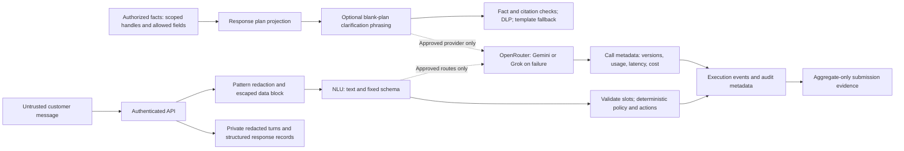

# Privacy and retention

Draft reviewed 2026-09-27 UTC. Aclara is synthetic, but data is handled as private.
The [provenance register](../data-provenance.md) identifies input classes. Organizer
published data-use terms still need owner confirmation before any organizer-derived
field values are sent to an external model. This document grants no new permission.
The local default is `LLM_PROVIDER=mock`. Current production config uses Gemini
via OpenRouter and Grok failure fallback, with **live TypeSafe Jev disabled**.
The lead's next Azure image release is pending. The live external-model data flow
is OpenRouter only. [ADR-0017](../adr/0017-drop-jev-from-live-path.md).
These are **post-v4 fixes, not reflected in v4 numbers**: v4 included Jev risk
support and offline Jev judging. Historical evaluation/study code and judge
evidence remain; they are separate from live traffic. TypeSafe standard-account
ZDR remains unverified; synthetic approval is not permission for real data.
[Jev limits](../ml/typesafe-jev-comparison.md), [release record](../status/progress-log.md).

The frozen workload's Portuguese authoring already used approved, project-generated
text through OpenRouter and a second model vendor. Its
[provenance](../../evals/suites/test/provenance.json) is separate from application
inference. No model call was made for this submission-docs or frontend follow-up.

## What crosses each boundary

| Input or record | Actual handling and boundary |
| --- | --- |
| Customer message | NLU receives pattern-redacted text in an escaped data block. Full conversation history and identity maps are not the current NLU payload. User text may still contain names or identifiers missed by the patterns. |
| Transaction facts | Optional phrasing receives the response type, language and approved fact ID/value pairs. The current adapter supplies all non-null fields from the scoped transaction projection: merchant, amount/currency, date/status/type and opaque handle. It does not receive the whole ledger. |
| Identity, authorization and risk | Session capabilities, OTP/passwords, full account/card numbers, document/contact/address/birth fields, income/credit scores, raw fraud score and fraud label must never be supplied as model context. Policy/risk is computed in code. |
| Model output | Validated structured slots or a bounded draft. Critical action language uses templates; draft facts/citations/DLP are checked. Reasoning/thinking blocks are not stored or rendered. |
| Provider call records | Provider/model, prompt hash/version, tokens, latency, price/cost and validation status. The call-record schema omits prompt/completion bodies and thinking. |
| Operational records | The API persists redacted customer text and the structured customer-facing response in turns; execution records include the response, events, outcome, policy and system. These are private content-bearing records, not content-free telemetry. |
| Telemetry and audit | Action IDs, scope, hashes, versions and status only; do not export turn bodies, prompts or thinking. Complete centralized telemetry/export verification remains pending. |
| Evaluation and screenshots | Per-case records and screenshots stay in ignored local `artifacts/`. Submitted evidence contains aggregates, schemas and project-generated demonstrations only. Never capture password/OTP screens for the public video. |
| Training and tracking | Organizer-derived recollections/predictions and MLflow stores stay local/ignored. Committed matcher artifacts contain numeric parameters, metrics and provenance, not source rows. |

The actual payload construction is in [structured NLU](../../src/aclara/agent/nlu/structured.py),
[reply building](../../src/aclara/agent/nlg/builder.py),
[redaction/DLP](../../src/aclara/agent/nlg/grounding.py) and
[operational persistence](../../src/aclara/api/app.py). Redaction is a pattern filter,
not complete anonymization. Do not send real customer text on the strength of it.

## Provider-specific terms and release status

These are service-level source summaries, not a verification of our account settings
or a legal determination. Confirm the exact endpoint, billing tier, region, feature,
subprocessors and contract immediately before an approved run. A model brand reached
through a gateway does not inherit the direct API's terms automatically.

| Route | Published handling | Aclara status / required check |
| --- | --- | --- |
| OpenRouter gateway | [ZDR documentation](https://openrouter.ai/docs/guides/features/zdr) says request `provider.zdr=true` restricts inference to ZDR endpoints; its own prompt logging is opt-in. In-memory provider caching is permitted under its ZDR definition; tool/plugin retention is separate. | Adapter sends `data_collection: deny` and `zdr: true`. Test `test_openrouter_request_uses_strict_schema_and_privacy_flags` checks the request, not the provider's actual deletion. Verify account logging, routed endpoint and terms. No plugins/tools are enabled by the adapter. |
| Google Gemini API direct | [Google terms](https://ai.google.dev/gemini-api/terms) distinguish unpaid use, where content can improve products and be human-reviewed, from paid use, where prompts/responses are not used to improve products and limited abuse/legal logging remains. Regional/billing exceptions matter. | Free tier is not an accepted confidential-data default. Confirm billing classification, feature retention and processing location. Approved fixture authoring via OpenRouter is a different route. |
| Anthropic API direct | [Commercial training terms](https://privacy.claude.com/en/articles/7996885-how-do-you-use-personal-data-in-model-training) exclude training by default except opt-in/feedback programs. [Retention policy](https://privacy.claude.com/en/articles/7996866-how-long-do-you-store-my-organization-s-data) describes standard deletion within 30 days with contract, safety/legal and feature exceptions. | Candidate only. [Covered-model retention](https://privacy.claude.com/en/articles/15425996-data-retention-practices-for-covered-models) can impose separate retention requirements. Verify exact model/feature terms and applicable ZDR agreement; do not infer ZDR from a key or model name. |
| xAI API direct | [API security FAQ](https://docs.x.ai/developers/faq/security) states no training on inputs/outputs without permission; default auditing retention is 30 days and ZDR changes available features. | Candidate only; account-level ZDR and feature behavior have not been verified. |
| Qwen via Alibaba Model Studio | [Privacy notice](https://www.alibabacloud.com/help/en/model-studio/privacy-notice) says customer data is not used for model training, while model/application call data is stored under applicable agreements. | Candidate only. Exact retention, processing region and agreement need account-specific review. No blanket zero-retention claim. |
| DeepSeek direct | [General privacy policy](https://cdn.deepseek.com/policies/en-US/deepseek-privacy-policy.html) includes content use for improvement/training and purpose-based retention; it does not establish downstream API end-user commitments for this project. A general policy is not a signed API processing agreement. | Direct path held for terms review. Do not assume an OpenRouter endpoint and the direct API have the same handling. |
| Models sold by Azure in Microsoft Foundry | [Microsoft's data terms](https://learn.microsoft.com/en-us/azure/foundry/responsible-ai/openai/data-privacy) exclude foundation-model training without permission, while abuse review, stateful features and deployment type affect storage and processing geography. | No Foundry model deployment is claimed. Azure hosting of the app/database does not establish model-provider terms or regional inference. |
| Local mock | No external inference request. | Current application default; deterministic fallback evidence is not real-model quality. |

Provider terms must be reviewed alongside the [model comparison](../ml/model-comparison.md)
and explicit cost approval. The frontend worktree's separate provider key is unused;
its existence or credit limit does not authorize a run.

## Retention: target policy versus enforcement

The durations below are the synthetic-policy targets in brief §12.3, **not measured
or implemented deletion guarantees**. Automated purge and its verification test have
not been found in the current implementation. Expiry denies access but is not deletion.

| Record | Target policy | Current state / required verification |
| --- | --- | --- |
| Conversations and turns | 30 days | Durable Postgres records; implement scoped purge, verify removal and account for backups. |
| Execution records | 90 days | Durable private records with content-bearing responses; implement/test purge and restricted access. |
| Audit | 1 year | Append-only API privileges and hash-chain checks; define owner-run retention, external anchors and legal-hold behavior before deletion. |
| Evaluation outputs, raw lake and recollection cards | Private storage only; no approved automatic deadline yet | Ignored local files remain until controlled cleanup. Owner must set a deadline and verify deletion from copies/backups without destroying required aggregate provenance. |
| Browser sessions / UI fixtures | Short-lived access and workspace expiry | Cookie/adapter expiry is access control. In-memory fixture cleanup is neither durable retention nor multi-instance storage. |
| Provider content | Route/feature/contract-specific, as above | Application purge cannot delete vendor copies. Verify the provider agreement and supported deletion path separately. |

Before real data: assign retention ownership, enumerate stores/backups, implement a
purge dry-run with aggregate counts, test scope/legal-hold exclusions, then test actual
deletion and restore behavior. Secrets remain in ignored local environment files or
Key Vault, never in these documents, browser bundles, recorded traces or submission email
attachments. The email may carry the judge access code and demo credentials only through
the owner's approved delivery process; this task does not send it.
