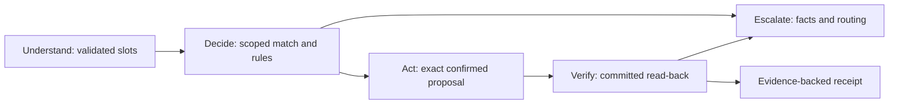

# Aclara — six-slide submission draft

Draft only; no deck export or publication is claimed. Use project-generated demo
records and aggregate evidence. Do not show credentials, organizer rows or model
thinking. Numbers below are rounded from linked pipeline/result JSON; unresolved
claims remain `TODO(results)`. The mock diagnostic failed acceptance gates.

## Slide 1 — A costly problem, a narrow addressable workflow

- Complaint contacts: **17.1% of volume**, **23.1% of handling time**, **43.6% FCR**.
- Unrecognized charges: **12,297 / 67,095 complaints (18.33%)**. Fee complaints stay
  with humans; they are not added to the automation base.
- Transactional contacts include charge questions, but the entire category is not
  addressable charge demand.

| This synthetic history supports | It does not support |
| --- | --- |
| Workflow prioritization, anomaly discovery, reproducible test fixtures | Production savings, causal agent effects, human-language accuracy |
| Aggregate handling burden and complaint mix | An assumption that every contact is an eligible autonomous action |

Speaker note: correct the brief's shorthand. Complaints have the lowest FCR, but
Comercial has greater average handling time. The combined charge/fee share is not
our charge-only scope. Do not repeat the broader percentage as automatable demand.

Source: [pipeline JSON](../data/problem-analysis-aggregates.json), `contact_reasons`,
`complaint_mix`, `tables`; [analysis and caveats](../problem-analysis.md).

## Slide 2 — Understand a charge, confirm intake, reach a person

| Path in ES/PT | Autonomy boundary |
| --- | --- |
| Explain a pending or posted charge | Scoped records; evidence and rule IDs; no promised refund |
| Clarify an ambiguous recollection, then eligible dispute intake | Customer selects; code checks policy; exact proposal, fresh verification and explicit confirmation |
| Fraud or mandatory-human case | Verified handoff; separate optional card freeze with fresh OTP and confirmation |

Judge steps: open the [restricted demo](https://ca-web-aclara-dev-eastus2.lemonbeach-1b769de0.eastus2.azurecontainerapps.io/),
use **access code and demo personas provided in the submission email**, then follow
[the five scenarios](../../README.md#judge-quickstart--submission-draft). Never use
real data. Current owner-IP access is not judge-ready; approved access and exact
release verification must precede submission. Staff views are current-workspace
scoped; cloud currently uses customer role and disables reset.

Source: [API contract](../../contracts/interfaces/openapi.json),
[frontend PR #17](https://github.com/sebastian-gm/bank-agent-lab/pull/17).

## Slide 3 — Language is probabilistic; authority lives in code

The model cannot choose an identity, bypass policy or execute a bank write.
Postgres uses a non-owner role and forced customer/run/session RLS. Confirmation
rechecks authority and eligibility. Templates handle critical claims; optional
phrasing must pass fact/citation/DLP checks. Safe failure and escalation remain
available. The UI shows records/rules/read-backs, never thinking.

Source: [system/state diagrams and responsibility table](../architecture.md),
[threat/control/test matrix](../security/threat-model.md).

## Slide 4 — Reproducible data and a candid learned-component result

- Source hashes → contracted incremental silver → tested complete gold snapshot →
  explicit checksummed serving load. Schema changes quarantine; unsafe complaint
  links are excluded, not guessed. Regeneration changes the recorded fingerprint.
- Customer/time splits, frozen synthetic query generation, held-out noise family
  and validation-only selection protect matcher evaluation from obvious leakage.
- Matcher test top-1: rules **86.59%**, logistic **96.78%**, LightGBM **95.22%**.
  Human language validation is still pending.
- Accent matching did not justify routing. The fraud-score step at the supplied
  threshold is generator structure, not evidence of a learned fraud detector.

Speaker note: normalized slots are not human recollections. LightGBM remains chosen
by the pre-registered validation rule even though logistic has lower test cost.
No threshold is retuned on the frozen suite.

Sources: [pipeline/runbook](../data/pipeline-runbook.md),
[aggregate hypotheses](../data/problem-analysis-aggregates.json),
[matcher metrics](../../models/charge_matcher/v1/metrics.json),
[validation metadata](../../models/charge_matcher/v1/metadata.json),
[result review](../ml/result-review.md).

## Slide 5 — Mock diagnostic: no AI gain; acceptance failed

| Held-out metric | B1 | P/mock |
| --- | ---: | ---: |
| Executed / workload | 198/200 | 200/200 |
| SAR / in scope | 67/193 (34.7%) | 67/193 (34.7%) |
| Forbidden policy actions / executed | 6/198 | 6/200 |
| Correct complete transfers / required | 0/66 | 0/66 |
| Local in-process turn p95 | 2.18 ms | 2.42 ms |
| Model inference cost | US$0 | US$0 |

Both SAR Wilson 95% intervals: **28.36–41.67%**. P fell back to rules; paired SAR
change is zero. ES SAR is **37/96**; PT **22/77**, with different rule/category mix
and pending human labels. Zero disclosure observations have upper bounds **1.52%**
(B1) / **1.50%** (P); they are not zero-risk guarantees. Local timings exclude cloud,
network and models. Later staff changes were not measured in this run.

Separate matcher risk/coverage curve points (candidate errors, not unsafe writes):

| LightGBM threshold | Coverage | Wrong-candidate risk among covered |
| --- | ---: | ---: |
| 0.50 | 75.47% | 3.58% |
| 0.80 | 65.33% | 0.71% |
| 0.90 | 62.37% | 0.53% |
| 0.95 | 60.13% | 0.39% |

Speaker note: exported visual can plot these existing points; they are descriptive,
not a proposal to retune test thresholds. Logistic has lower test expected cost;
LightGBM made about four times fewer wrong proposals at different coverage.
TODO(results): approved real-model comparison, deployed latency/cost and human workload.

Sources: corrected [B1](../evaluation/heldout-run01-B1.json),
[P/mock](../evaluation/heldout-run01-P-mock.json),
[paired/repeats](../evaluation/heldout-run01-comparison.json),
[matcher `risk_coverage`](../../models/charge_matcher/v1/metrics.json).

## Slide 6 — The path to production begins with the failed gates

- Fix acceptance gaps on independent development cases; preserve the frozen result.
  Complete human labels, language review and approved real-model comparison.
- Replace simulated identity with real IdP/MFA and task-scoped staff access.
  Move dependencies to private networking; the dev Azure-services database firewall
  exception is not app-only isolation.
- Add real banking integration, scheduled data freshness, durable shared model
  budgets, verified retention, independent audit anchors, DR/load tests and on-call.
- Agent-hours and time-to-case remain a **projection**, with missing inputs and
  low/base/high sensitivity. No production savings are claimed.
- The control pattern could extend to fees, replacement and payment status only
  after new policy, authorization and verification work.

Sources: [production gates](../production-readiness.md), [limits](../limitations.md),
[provider privacy](../security/privacy-and-retention.md),
[projection](../evaluation/business-projection.md).
