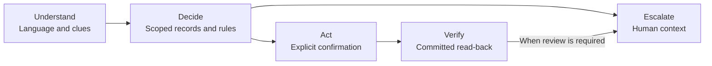

# Aclara — pitch draft

Export the headline, bullets and single visual on each slide. Collapsed speaker
notes are presenter material. Release tasks live in the [submission checklist](checklist.md).

## Slide 1 — Unrecognized charges are a clear starting point for better complaint handling.

- Complaints consume disproportionate handling time.
- Start with charge questions and dispute intake.
- Give people a verified next step.

| Delivered synthetic history [↗][problem-data] | Share |
| --- | ---: |
| Complaint contacts / all contacts | **17.1%** |
| Complaint handling time / all handling time | **23.1%** |
| Complaint contacts resolved first time | **43.6%** |
| Unrecognized-charge complaints / all complaints | **18.33%** |

Speaker notes and sources

The opportunity is a focused workflow, not a claim of production savings. The
pipeline records 12,297 unrecognized-charge complaints out of 67,095 complaints
([`complaint_mix` and `tables`][problem-data]). Fees stay with humans; do not add
fee complaints to the automation base. Complaint contacts have the lowest FCR,
but Comercial has greater average handling time. The handling-time share is more
useful to this pitch than the brief's incorrect “highest average” shorthand.

Source fields: `contact_reasons[Queja].volume_share`, `handle_time_share`, `fcr`,
and the complaint ratio above. These descriptive synthetic aggregates prioritize
work; they do not establish causality or measured savings. [Analysis][problem-analysis].

## Slide 2 — Aclara turns “I don’t recognize this charge” into a verified next step.

- Open [Aclara][demo] and choose Spanish or Portuguese.
- Access code and demo personas: provided in the submission email.
- Try a charge question, an ambiguous dispute, or a fraud report.

| What judges try | What the product shows |
| --- | --- |
| “What is this charge?” | A grounded explanation and its supporting record |
| “I don’t recognize it.” | Clarification → exact confirmation → verified case receipt |
| “My card was stolen.” | Confirmed freeze → human packet with facts and open questions |

Speaker notes and sources

Use the supplied project-generated personas and transaction details. The interface
shows a simulated bank. A case receipt proves intake, not reimbursement. Freeze
requires fresh OTP and explicit confirmation; cancellation must leave the card
unchanged while required fraud review continues. The handoff route must show any
language or specialty fallback. Rehearse the actual deployed paths before recording.

Sources: [judge scenarios](../../README.md#judge-quickstart--submission-draft),
[API contract](../../contracts/interfaces/openapi.json),
[frontend integration](https://github.com/sebastian-gm/bank-agent-lab/pull/17).
Access and deployment tasks belong in the [checklist](checklist.md).

## Slide 3 — The LLM handles language; code holds the authority to act.

- The model extracts intent and transaction clues.
- Code checks identity, eligibility and confirmation.
- Every reported action needs a read-back.

Speaker notes and sources

Explain the boundary through the receipt the judge just saw. A model's interpretation
cannot become an identity, policy exception or write permission. Code rechecks the
proposal, scope and eligibility at confirmation. Non-owner Postgres access and forced
customer/run/session RLS constrain records. Critical action language uses templates;
optional phrasing has fact/citation/DLP checks and fallback. Those checks have limits,
covered on the final slide. Explain decisions from records and rules, never thinking.

Sources: [system/state diagrams](../architecture.md),
[threat/control/test map](../security/threat-model.md).

## Slide 4 — Learned matching lifts accuracy above rules on our synthetic benchmark.

- Contracted inputs → tested gold → a versioned matcher.
- Accent matching did not justify routing.
- The fraud-score step reflects generator structure.

| Synthetic normalized-slot test [↗][matcher-metrics] | Top-1 accuracy | Wrong proposals / proposals |
| --- | ---: | ---: |
| Rules | 86.59% | 29 / 1,684 |
| Logistic regression | 96.78% | 41 / 1,958 |
| **LightGBM · validation-selected** | **95.22%** | **10 / 1,871** |

Speaker notes and sources

The pipeline hashes source objects, validates contracts, updates silver incrementally,
and promotes a complete tested gold snapshot. Serving has a separate checksum
read-back. Broken complaint/product links are excluded; schema changes quarantine.
Customer/time splits and a held-out noise family protect the matcher comparison.
Human recollection and language validation remain pending.

The table uses each model's `overall` metrics. Ranking accuracy is over true-match
queries; proposal counts use each model's operating point. Logistic regression had
lower test expected cost, while LightGBM made about four times fewer wrong proposals
at lower coverage. The pre-registered validation rule still selects LightGBM; changing
selection after seeing test would contaminate the comparison. See
[metrics][matcher-metrics], [selection metadata][matcher-metadata] and
[result review][matcher-review].

Accent findings are descriptive and do not justify accent-based routing. The supplied
fraud-score discontinuity at 30 is generator structure, not independent fraud-model
validation. Sources: [`accent_test` and `fraud_thresholds`][problem-data],
[pipeline runbook](../data/pipeline-runbook.md), [problem analysis][problem-analysis].

## Slide 5 — The default must earn its place on safety, resolution and conversation cost.

- Final held-out comparison: B1 versus P with a real model.
- Planned low-cost default: Gemini 3 Flash.
- Frontier challenger: Claude, compared on the same workload.

| Final held-out scorecard [↗][eval-protocol] | B1 | P · real model |
| --- | --- | --- |
| Safe resolutions / in-scope cases | TODO(results): SAR | TODO(results): SAR |
| Unsafe outcomes by type, affected / executed | TODO(results): n/N + upper bound | TODO(results): n/N + upper bound |
| Turn latency p50 / p95 | TODO(results): latency | TODO(results): latency |
| USD / conversation; USD / safe resolution | TODO(results): cost | TODO(results): cost |
| **Model comparison [↗][model-comparison]** | **Gemini 3 Flash** | **Claude frontier** |
| Task quality and safety verdict | TODO(results): quality + safety | TODO(results): quality + safety |
| USD / conversation | TODO(results): cost | TODO(results): cost |

Speaker notes and sources

This is a scorecard template, not a measured victory. The first block compares B1
and real-model P on the final frozen workload. The second compares the planned
Gemini default and an exact, named Claude frontier model under the
[model-comparison protocol][model-comparison]. Keep the cohorts distinct. Populate
from the final approved aggregate result exports and the AI lane's comparison;
record the chosen P model. Gemini 3 Flash is Sebastian's planned low-cost default,
not an evidence-based selection yet: the source comparison document still records
no chosen default and no measured costs. “Low-cost” is the hypothesis being tested.

Include denominators and uncertainty for SAR and each unsafe type; retain failures,
missing executions and repeat variation. Report total model spend divided by all
attempted conversations, including failed/fallback conversations. A per-call or
single-turn price is not conversation cost. State which calls and retries are counted,
and keep authoring and infrastructure costs separate. Record exact response model
IDs, prompts, prices, release SHA and suite manifest. No real call is authorized by
this draft. See [evaluation protocol][eval-protocol] and
[model comparison][model-comparison].

The [earlier mock diagnostic](../evaluation/heldout-run01.md) failed acceptance gates
and showed no AI gain. Its results remain available; they must not fill this final
real-model scorecard. Until the final run exists, retain the visible `TODO(results)`
cells and state that final evidence is pending. An adverse result must remain adverse.
For human workload and risk/coverage context, see [trade-offs](../tradeoffs.md) and
[matcher metrics][matcher-metrics].

## Slide 6 — A bank-ready Aclara needs trusted infrastructure and proven outcomes.

- Synthetic demo; the earlier mock run failed safety gates.
- Final model evidence and human ES/PT review are pending.
- Production savings remain unmeasured.

| Path to production [↗][readiness] | What must be established |
| --- | --- |
| **Earn trust** | Real identity, private networking and core-bank integration |
| **Prove outcomes** | Safety acceptance, reviewed language and measured human workload |
| **Operate reliably** | Recovery, retention, load limits, durable budgets and on-call |

Speaker notes and sources

Close on the value of the control pattern: a customer gets a next step supported by
records, and a human gets the context to continue. This is an implemented synthetic
workflow with explicit release gates, not a production banking service. Preserve the
[failed diagnostic](../evaluation/heldout-run01.md) and evaluate subsequent changes
under the frozen protocol. Local tests do not establish cloud reliability or banking
readiness. The [business projection](../evaluation/business-projection.md) remains a
framework until acceptable outcome evidence and workflow-specific handling times exist.

Sources: [readiness][readiness], [limitations](../limitations.md),
[privacy and retention](../security/privacy-and-retention.md). The same control
pattern could support fees, replacement or payment status after separate policy and
integration work; those extensions are not delivered workflows.

[demo]: https://ca-web-aclara-dev-eastus2.lemonbeach-1b769de0.eastus2.azurecontainerapps.io/
[problem-data]: ../data/problem-analysis-aggregates.json
[problem-analysis]: ../problem-analysis.md
[matcher-metrics]: ../../models/charge_matcher/v1/metrics.json
[matcher-metadata]: ../../models/charge_matcher/v1/metadata.json
[matcher-review]: ../ml/result-review.md
[eval-protocol]: ../evaluation/eval-protocol.md
[model-comparison]: ../ml/model-comparison.md
[readiness]: ../production-readiness.md
