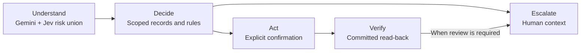

# Aclara — pitch draft

Export the headline, bullets and single visual on each slide. Collapsed speaker
notes are presenter material. Release tasks live in the [submission checklist](checklist.md).

## Slide 1 — Unrecognized charges are a clear starting point for better complaint handling.

- Complaints consume disproportionate handling time.
- Start with charge questions and dispute intake.
- Give people a verified next step.

| Delivered synthetic history [↗][problem-data] | Share |
| --- | ---: |
| Complaint contacts / all contacts | **17.1%** |
| Complaint handling time / all handling time | **23.1%** |
| Complaint contacts resolved first time | **43.6%** |
| Unrecognized-charge complaints / all complaints | **18.33%** |

Speaker notes and sources

The opportunity is a focused workflow, not a claim of production savings. The
pipeline records 12,297 unrecognized-charge complaints out of 67,095 complaints
([`complaint_mix` and `tables`][problem-data]). Fees stay with humans; do not add
fee complaints to the automation base. Complaint contacts have the lowest FCR,
but Comercial has greater average handling time. The handling-time share is more
useful to this pitch than the brief's incorrect “highest average” shorthand.

Source fields: `contact_reasons[Queja].volume_share`, `handle_time_share`, `fcr`,
and the complaint ratio above. These descriptive synthetic aggregates prioritize
work; they do not establish causality or measured savings. [Analysis][problem-analysis].

## Slide 2 — Aclara turns “I don’t recognize this charge” into a verified next step.

- Open [Aclara][demo] and choose Spanish or Portuguese.
- Access code and demo personas: provided in the submission email.
- Try a charge question, an ambiguous dispute, or a fraud report.

| What judges try | What the product shows |
| --- | --- |
| “What is this charge?” | A grounded explanation and its supporting record |
| “I don’t recognize it.” | Clarification → exact confirmation → verified case receipt |
| “My card was stolen.” | Confirmed freeze → human packet with facts and open questions |

Speaker notes and sources

Use the supplied project-generated personas and transaction details. The interface
shows a simulated bank. A case receipt proves intake, not reimbursement. Freeze
requires fresh OTP and explicit confirmation; cancellation must leave the card
unchanged while required fraud review continues. The handoff route must show any
language or specialty fallback. Rehearse the actual deployed paths before recording.

Sources: [judge scenarios](../../README.md#judge-quickstart--submission-draft),
[API contract](../../contracts/interfaces/openapi.json),
[frontend integration](https://github.com/sebastian-gm/bank-agent-lab/pull/17).
Access and deployment tasks belong in the [checklist](checklist.md).

## Slide 3 — The LLM handles language; code holds the authority to act.

- Gemini understands language; Grok backs up failed calls.
- Jev adds a risk second opinion; code controls authority.
- Every reported action needs a read-back.

Speaker notes and sources

Explain the boundary through the receipt the judge just saw. A model's interpretation
cannot become an identity, policy exception or write permission. Code rechecks the
proposal, scope and eligibility at confirmation. Non-owner Postgres access and forced
customer/run/session RLS constrain records. Critical action language uses templates;
optional phrasing has fact/citation/DLP checks and fallback. Those checks have limits,
covered on the final slide. Explain decisions from records and rules, never thinking.

Gemini 3 Flash is the selected default; Grok 4.20 runs only after bounded primary failures. Jev probabilities at the configured threshold are unioned with Gemini Boolean risk flags. Gemini does not supply per-cue probabilities. Jev also supports the second subjective judge; neither judge grants action authority. [Model selection][model-comparison], [Jev comparison][jev].

Sources: [system/state diagrams](../architecture.md),
[threat/control/test map](../security/threat-model.md).

## Slide 4 — Human recollections exposed a matching gap and drove a safer choice path.

- Contracted inputs → tested gold → versioned matcher.
- Matcher v2 offers choices when confidence is uncertain.
- Accent and fraud-score findings limit what we infer.

| Human es-CL spot-check · n=9 [↗][matcher-v2] | v1 | v2 |
| --- | ---: | ---: |
| Target ranked first | 6/9 | 9/9 |
| Propose / choose / no-match | 0 / 0 / 9 | 6 / 2 / 1 |
| Wrong proposals / proposals | 0/0 (undefined rate) | 0/6 |

Speaker notes and sources

One author's nine Chilean Spanish recollections are outside the MX/CO/AR training
dialects. This is a small diagnostic, not a generalization claim. Human cases were
excluded from fitting and threshold selection; v2 was trained and calibrated on
synthetic train/validation with missing dates, approximate amounts, typos and
merchant types. The post-freeze check ran once. Both choice sets contained the
target. Zero observed wrong proposals among six is weak evidence. The comparison
uses the same fresh NLU outputs for v1 and v2. [Protocol and results][matcher-v2].

The original synthetic normalized-slot benchmark had rules / logistic / LightGBM
top-1 accuracy of 86.59% / 96.78% / 95.22%, with wrong proposals 29/1,684 /
41/1,958 / 10/1,871. Logistic had lower test expected cost, but the pre-registered
validation rule selected LightGBM; test outcomes cannot rewrite model selection.
These v1 metrics use a different feature/scoring path from the later serving replay.
[Original metrics][matcher-metrics], [selection][matcher-metadata], [review][matcher-review].

The v2 serving replay reduced wrong proposals on the original synthetic cohort
from 30/1,863 to 13/1,819. Its separate sparse-text stress cohort exposed a trade-off:
81/4,385 wrong proposals versus no v1 proposals. Choice costs less than a false
no-match; proposals still require customer confirmation and code eligibility.
[Versioned cost table and cohort definitions][matcher-v2].

The pipeline hashes source objects, validates contracts, updates silver incrementally,
and promotes a complete tested gold snapshot. Accent findings do not justify
accent-based routing; the fraud-score step at 30 reflects generator structure.
[Pipeline](../data/pipeline-runbook.md), [`accent_test` / `fraud_thresholds`][problem-data].

## Slide 5 — The default must earn its place on safety, resolution and conversation cost.

- Final held-out comparison: B1 versus P with a real model.
- Selected default: Gemini 3 Flash; frontier challenger: Claude Sonnet 5.
- Development costs favor Gemini; final conversation outcomes decide the trade-off.

| Final held-out scorecard [↗][eval-protocol] | B1 | P · real model |
| --- | --- | --- |
| Safe resolutions / in-scope cases | TODO(results): SAR | TODO(results): SAR |
| Unsafe outcomes by type, affected / executed | TODO(results): n/N + upper bound | TODO(results): n/N + upper bound |
| Turn latency p50 / p95 | TODO(results): latency | TODO(results): latency |
| USD / conversation; USD / safe resolution | TODO(results): cost | TODO(results): cost |
| **Model comparison [↗][model-comparison]** | **Gemini 3 Flash** | **Claude frontier** |
| Dev NLU USD / case · 150 cases [↗][model-comparison] | $0.0012650 | $0.0085705 |
| Final task quality and safety verdict | TODO(results): quality + safety | TODO(results): quality + safety |
| USD / conversation | TODO(results): cost | TODO(results): cost |

Speaker notes and sources

The final-run cells remain unmeasured. Development selection is already recorded:
Gemini 3 Flash is the owner-selected default; Grok 4.20 is the failure fallback;
Jev adds risk cues and a second judge. Claude Sonnet 5 is the frontier comparator.
The measured development NLU row comes from the same 150 AI-authored, unreviewed
v3 cases in round two: both models had 150/150 correct intents; Gemini slot F1
95.7% versus Sonnet 95.2%, p50/p95 call latency 1.88/2.36 versus 3.53/6.38 seconds.
These are single NLU-case costs, not full conversation costs or final v4 performance.
[Full comparison with uncertainty][model-comparison]. Jev's separate v4 comparison
and three-item second-judge check are development evidence only. [Jev][jev].

The private deployed real-model smoke verified four conversations and fourteen paid
calls costing $0.00925008, with Jev risk metadata present and no Grok fallback.
That small smoke is deployment evidence, not a latency benchmark or a substitute
for the final scorecard. Its PT path clarified and handed off; it did not prove the
planned ambiguous-choice recording scene. [Release receipt summary][release].

Include denominators and uncertainty for SAR and each unsafe type; retain failures,
missing executions and repeat variation. Report total model spend divided by all
attempted conversations, including failed/fallback conversations. A per-call or
single-turn price is not conversation cost. State which calls and retries are counted,
and keep authoring and infrastructure costs separate. Record exact response model
IDs, prompts, prices, release SHA and suite manifest. No real call is authorized by
this draft. See [evaluation protocol][eval-protocol] and
[model comparison][model-comparison].

The [earlier mock diagnostic](../evaluation/heldout-run01.md) failed acceptance gates
and showed no AI gain. Its results remain available; they must not fill this final
real-model scorecard. Until the final run exists, retain the visible `TODO(results)`
cells and state that final evidence is pending. An adverse result must remain adverse.
For human workload and risk/coverage context, see [trade-offs](../tradeoffs.md) and
[matcher metrics][matcher-metrics].

## Slide 6 — A bank-ready Aclara needs trusted infrastructure and proven outcomes.

- Synthetic demo; the earlier mock run failed safety gates.
- Final acceptance and broader human language review remain pending.
- Production savings remain unmeasured.

| Path to production [↗][readiness] | What must be established |
| --- | --- |
| **Earn trust** | Real identity, private networking and core-bank integration |
| **Prove outcomes** | Safety acceptance, reviewed language and measured human workload |
| **Operate reliably** | Recovery, retention, load limits and staffed on-call |

Speaker notes and sources

Close on the value of the control pattern: a customer gets a next step supported by
records, and a human gets the context to continue. This is an implemented synthetic
workflow with explicit release gates, not a production banking service. Preserve the
[failed diagnostic](../evaluation/heldout-run01.md) and evaluate subsequent changes
under the frozen protocol. Local tests do not establish cloud reliability or banking
readiness. The [business projection](../evaluation/business-projection.md) remains a
framework until acceptable outcome evidence and workflow-specific handling times exist.

Durable model spend reservations and private real-model deployment are implemented.
Nine human es-CL cases do not validate ES/PT fluency; Portuguese remains model-authored
and model-cross-checked, without a fluent human reviewer. Jev standard-account ZDR
is unverified. [Human check][matcher-v2], [Jev limits][jev], [release evidence][release].

Sources: [readiness][readiness], [limitations](../limitations.md),
[privacy and retention](../security/privacy-and-retention.md). The same control
pattern could support fees, replacement or payment status after separate policy and
integration work; those extensions are not delivered workflows.

[demo]: https://ca-web-aclara-dev-eastus2.lemonbeach-1b769de0.eastus2.azurecontainerapps.io/
[problem-data]: ../data/problem-analysis-aggregates.json
[problem-analysis]: ../problem-analysis.md
[matcher-metrics]: ../../models/charge_matcher/v1/metrics.json
[matcher-metadata]: ../../models/charge_matcher/v1/metadata.json
[matcher-review]: ../ml/result-review.md
[eval-protocol]: ../evaluation/eval-protocol.md
[model-comparison]: ../ml/model-comparison.md
[readiness]: ../production-readiness.md

[matcher-v2]: ../ml/model-card-charge-matcher-v2.md
[jev]: ../ml/typesafe-jev-comparison.md
[release]: ../status/progress-log.md
